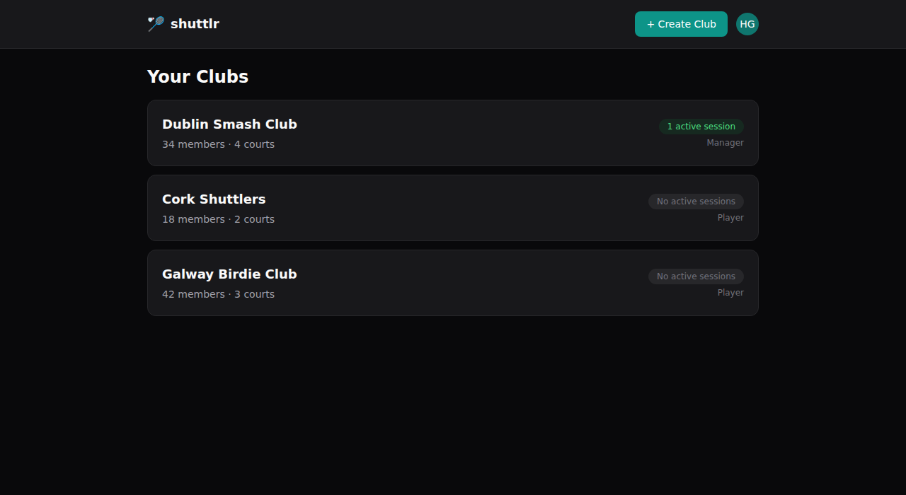
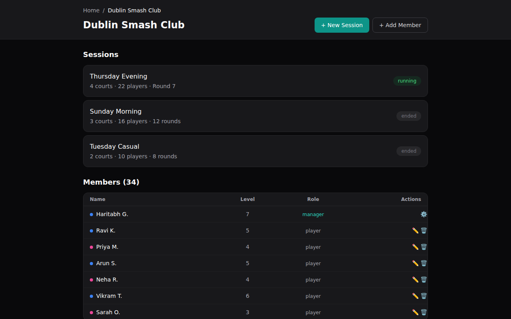
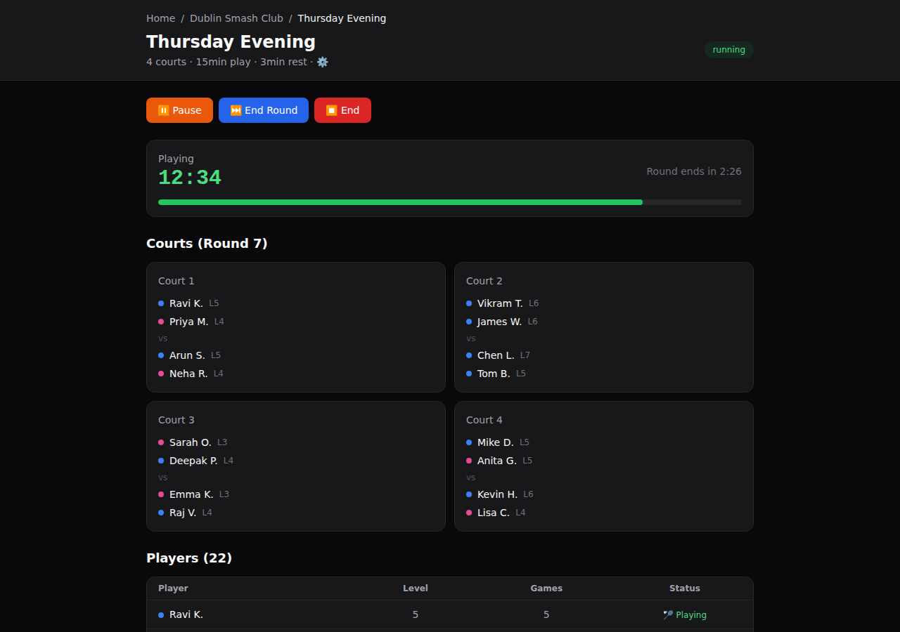

# 🏸 shuttlrs

If you run a badminton club, you know the drill. Twenty people show up, four courts, and someone has to figure out who plays next. Usually it's a whiteboard, a peg board, or a WhatsApp argument.

shuttlrs handles all of that. Court rotation, player selection, round timers — the whole thing runs itself so you can actually play.

**Try it:** [shuttlrs.com](https://shuttlrs.com)

---

## What it looks like

### Your clubs at a glance



### Managing a club — members, sessions, roles



### A session in action — courts, timer, player pool



### Sign in


---

## How it works

A manager creates a session, adds players, and hits start. From there:

1. The selection algorithm picks who plays on which court
2. A countdown timer runs for the configured play time
3. When time's up, there's an optional rest period
4. New courts are assigned automatically — players who've waited longest go first
5. Everyone gets a push notification when they're up

The algorithm tries to be fair about it. It tracks how many games each player has had, avoids repeating the same pairings, balances skill levels across courts, and mixes genders when possible. Not perfect, but way better than a whiteboard.

Sessions auto-end after 6 hours. If something goes wrong, managers can pause, resume, or end early.

## Open source

The whole thing is open source under Apache 2.0. You can self-host it, fork it, modify it — whatever you want.

If you'd rather not deal with hosting, use the managed version at [shuttlrs.com](https://shuttlrs.com). A paid tier is coming that'll help cover hosting costs and fund development.

## Self-hosting

You'll need Node.js 18+ and the [Supabase CLI](https://supabase.com/docs/guides/cli).

```bash
git clone https://github.com/haritabh17/shuttlrs.git
cd shuttlrs
npm install

supabase start
cp .env.local.example .env.local  # fill in your Supabase keys

supabase db push
npm run dev
```

### Environment variables

| Variable | What it does |
|----------|-------------|
| `NEXT_PUBLIC_SUPABASE_URL` | Your Supabase project URL |
| `NEXT_PUBLIC_SUPABASE_ANON_KEY` | Supabase public key |
| `SUPABASE_SERVICE_ROLE_KEY` | Supabase service key (server only) |
| `NEXT_PUBLIC_VAPID_PUBLIC_KEY` | For push notifications |
| `VAPID_PRIVATE_KEY` | Push notification private key (server only) |
| `VAPID_MAILTO` | Contact email for VAPID |

## Tech stack

Next.js 15, TypeScript, Tailwind, Supabase (Postgres + Auth + Realtime + Edge Functions), Vercel, Web Push API. Court selection runs via pg_cron → Edge Function every 10 seconds.

## Contributing

PRs and issues welcome. If you run a badminton club and something doesn't work the way you'd expect, open an issue — that's the most useful feedback.

## License

Apache 2.0 — see [LICENSE](LICENSE).
