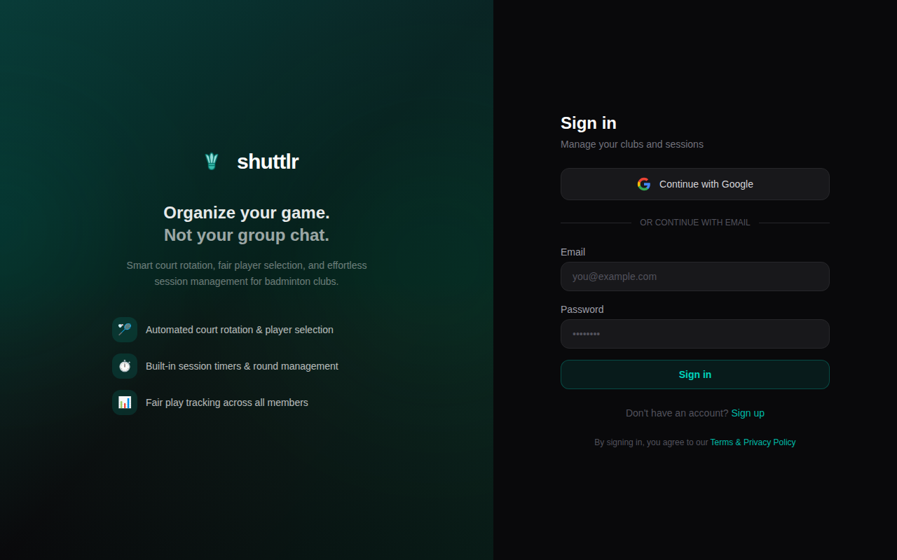

# 🏸 Shuttlr

Open-source badminton club management — session scheduling, court rotation, and automated player selection.

**Live:** [shuttlrs.com](https://shuttlrs.com) · **License:** Apache 2.0



## What it does

Shuttlr takes the chaos out of running badminton club sessions. No more WhatsApp arguments about who plays next.

- **Automated court rotation** — fair player selection based on play count, rest time, and teammate history
- **Real-time updates** — see court assignments live as they happen
- **Push notifications** — get notified when you're up next
- **Session management** — configurable play/rest times, pause/resume, round controls
- **Club management** — members, roles, nicknames, skill levels
- **Works on phones** — PWA with home screen install support

## How the selection works

The algorithm optimizes for:
1. **Fairness** — players with fewer games get priority
2. **Rest** — longest-waiting players selected first
3. **Balance** — mixed-gender courts when possible, level variance minimized
4. **Variety** — teammate repeat penalty to avoid same pairings

## Tech stack

- **Frontend:** Next.js 15 (App Router), TypeScript, Tailwind CSS
- **Backend:** Supabase (Postgres, Auth, Realtime, Edge Functions)
- **Scheduling:** pg_cron → Edge Function (session-tick) every 10s
- **Push:** Web Push API with VAPID keys
- **Hosting:** Vercel
- **CI/CD:** GitHub Actions (main → beta, production → prod)

## Architecture

```
Browser ←→ Next.js (Vercel) ←→ Supabase (Postgres + Auth + Realtime)
                                      ↑
                              pg_cron → Edge Function (session-tick)
                                      ↓
                              Selection algorithm → Court assignments
                                      ↓
                              Push notification → /api/push/send → Web Push
```

## Self-hosting

```bash
# Prerequisites: Node.js 18+, Supabase CLI

git clone https://github.com/haritabh17/shuttlr.git
cd shuttlr
npm install

# Set up Supabase locally
supabase start
cp .env.local.example .env.local  # fill in your keys

# Push migrations
supabase db push

# Seed test data (optional)
npx tsx scripts/seed.ts

# Run dev server
npm run dev
```

## Environment variables

| Variable | Description |
|----------|-------------|
| `NEXT_PUBLIC_SUPABASE_URL` | Supabase project URL |
| `NEXT_PUBLIC_SUPABASE_ANON_KEY` | Supabase anon/public key |
| `SUPABASE_SERVICE_ROLE_KEY` | Supabase service role key (server-side only) |
| `NEXT_PUBLIC_VAPID_PUBLIC_KEY` | VAPID public key for Web Push |
| `VAPID_PRIVATE_KEY` | VAPID private key (server-side only) |
| `VAPID_MAILTO` | Contact email for VAPID (e.g. `mailto:you@example.com`) |
| `ALLOWED_EMAILS` | Comma-separated email whitelist (beta only) |

## Project structure

```
src/
├── app/
│   ├── api/              # API routes (push, members, sessions, courts)
│   ├── auth/             # OAuth callback, signout
│   ├── clubs/[slug]/     # Club page + session pages
│   ├── login/            # Login page
│   ├── profile/          # Profile editor
│   └── page.tsx          # Home (club list)
├── components/           # UI components
├── lib/
│   ├── selection.ts      # Player selection algorithm
│   └── supabase/         # Supabase client helpers
public/
├── sw.js                 # Service worker for push notifications
├── manifest.json         # PWA manifest
supabase/
├── functions/            # Edge Functions (session-tick)
├── migrations/           # Database migrations
scripts/
└── seed.ts              # Test data seeder
```

## Contributing

Contributions are welcome! Open an issue or submit a PR.

## License

Apache License 2.0 — see [LICENSE](LICENSE) for details.
